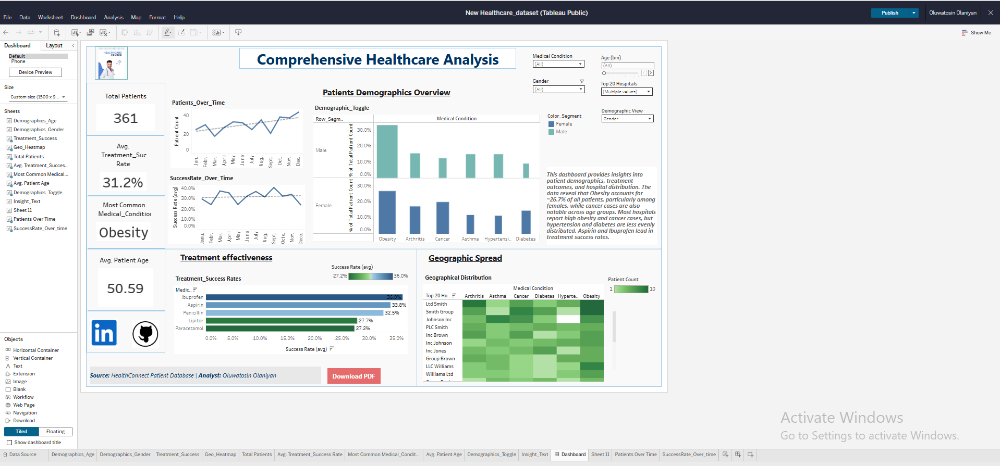

# healthcare-dashboard-analysis
# 🏥 Comprehensive Healthcare Analysis — Health Connect Project

**Objective:**  
As a Data Analyst at **Health Connect**, a fictitious healthcare innovation company, I was tasked with analyzing patient data to uncover trends, evaluate treatment outcomes, and identify common medical conditions across demographics and regions.  

This project aimed to provide actionable insights to help management make data-driven decisions on healthcare delivery, patient engagement, and resource allocation.  

---

## 🛠 Tools & Skills
- **Tool:** Tableau  
- **Skills:** Data cleaning, trend analysis, dashboard design, KPI tracking, storytelling with data  

---

## 📊 What I Built
Using a cleaned healthcare dataset, I developed an **interactive Tableau dashboard** covering:  
1. **Patient Demographics Overview** — distribution of gender, age, and medical conditions.  
2. **Treatment Success Rates** — comparison of success rates across medications and diagnoses.  
3. **Geographical Distribution** — mapping of disease prevalence and hospital coverage.  
4. **KPI Summary Panel** — key statistics including total patients, success rates, and common conditions.  

---

## 📈 Key Insights
- **Obesity** emerged as the most common medical condition, representing **~26.7%** of total patients, particularly among females.  
- **Aspirin and Ibuprofen** led in treatment success, indicating potential efficiency in addressing common conditions.  
- **Hypertension and diabetes** show moderate prevalence but are **less evenly distributed** across hospitals.  
- **Average treatment success rate:** **31.2%** — highlighting opportunities for improvement through targeted interventions.  

---

## 📸 Dashboard Preview

👉 [View the Interactive Dashboard on Tableau Public](https://public.tableau.com/app/profile/oluwatosin.olaniyan/viz/NewHealthcare_dataset/Dashboard32)

---

## 🧠 Reflections
This was my **second attempt** at this project after completing it once as a beginner.  
This time, I refined the analysis, restructured the data model, and focused on storytelling through KPIs and visuals.  

It reaffirmed that **data visualization isn’t just about charts — it’s about clarity, simplicity, and business impact.**

---

## 📂 Files
- `/tableau/healthcare_dashboard.twbx` — Tableau workbook  
- `/data/healthcare_dataset_cleaned.xlsx` — cleaned dataset   
- `/assets/healthcare_dashboard.png` — screenshot of final dashboard  

---

## 🔎 How to View
1. Open the Tableau Public link above to explore interactively.  
2. Or download the `.twbx` file to view locally in Tableau Public/Desktop.  

---

## 📜 License
MIT © Oluwatosin Olaniyan
